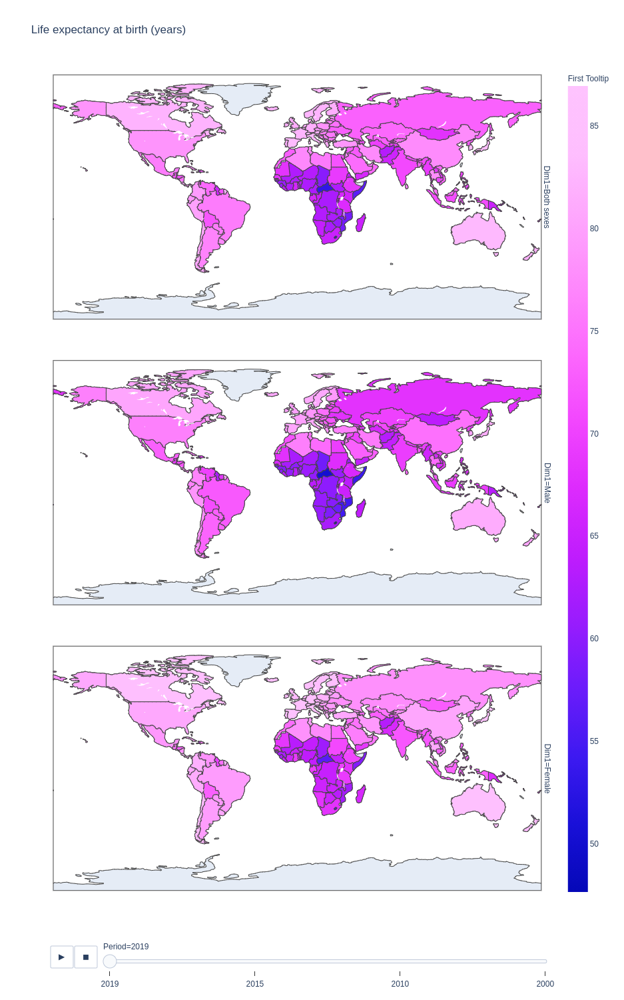
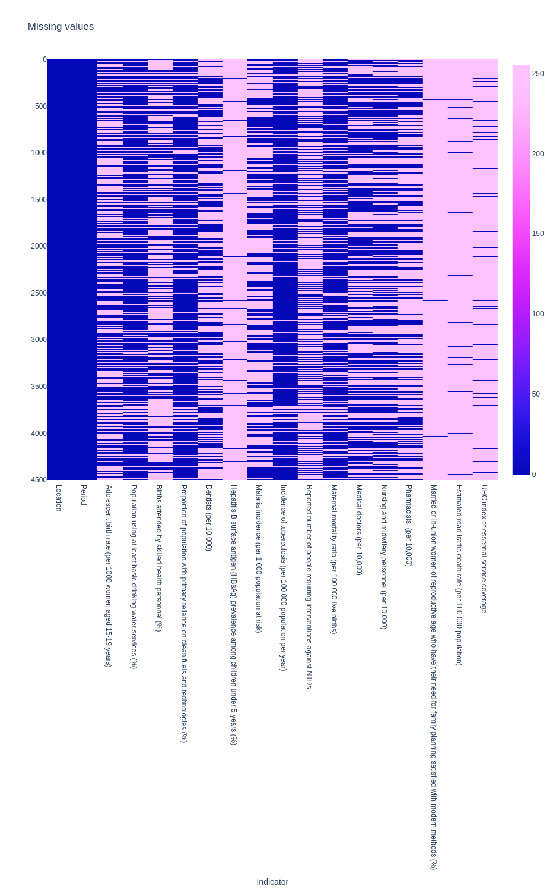

# WHO Health Statistics for 2020
## A Quick analysis

# Structure of Repository
| Item | Description |
|---|---|
| [EDA](EDA.ipynb) | Jupyter notebook containing the Exploratory Data Analysis |
| [source](source/) | Directory containing the `.csv` files (one file per indicator) |
| [img](img/) | Directory with the images generated in the various notebooks |
| [README](README.md) | This file, providing an overview of the project |

# Missing Data

The following graph represents the missing values (in pink) for a few selected indicators:

Although the data covers most (if not all) the countries, and values are available for several years, there is a lot of missing values. We will probably have to avoid a few indicators if we want to make progress. Other indicators will need to be completed in order to be useful.
# Data
The dataset is from [this](https://www.kaggle.com/utkarshxy/who-worldhealth-statistics-2020-complete) Kaggle page.
The [source](source/) data is made of 39 comma-separated-values files. Each file is an indicator:

* 30-70cancerChdEtc.csv
* adolescentBirthRate.csv
* airPollutionDeathRate.csv
* alcoholSubstanceAbuse.csv
* atLeastBasicSanitizationServices.csv
* basicDrinkingWaterServices.csv
* basicHandWashing.csv
* birthAttendedBySkilledPersonal.csv
* cleanFuelAndTech.csv
* crudeSuicideRates.csv
* dataAvailibilityForUhc.csv
* dentists.csv
* eliminateViolenceAgainstWomen.csv
* HALElifeExpectancyAtBirth.csv
* HALeWHOregionLifeExpectancyAtBirth.csv
* hepatitusBsurfaceAntigen.csv
* incedenceOfMalaria.csv
* incedenceOfTuberculosis.csv
* infantMortalityRate.csv
* interventionAgianstNTDs.csv
* lifeExpectancyAtBirth.csv
* maternalMortalityRatio.csv
* medicalDoctors.csv
* mortalityRatePoisoning.csv
* mortalityRateUnsafeWash.csv
* neonatalMortalityRate.csv
* newHivInfections.csv
* nursingAndMidwife.csv
* ofHaleInLifeExpectancy.csv
* pharmacists.csv
* population10SDG3.8.2.csv
* population25SDG3.8.2.csv
* reproductiveAgeWomen.csv
* roadTrafficDeaths.csv
* safelySanitization.csv
* tobaccoAge15.csv
* uhcCoverage.csv
* under5MortalityRate.csv
* WHOregionLifeExpectancyAtBirth.csv

The files have a similar structure:
| Country | Year | Indicator | Value |
|---|---|---|----|

But some indicators will offer values on a gender level (marked by an additional column containing `Both Genres`, `Male`, `Female`).